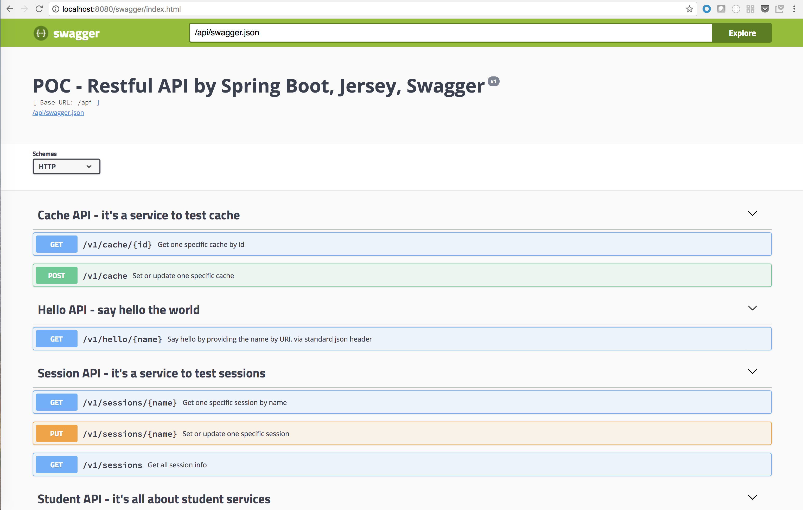

# springboot-jersey-swagger

[](https://travis-ci.org/brightzheng100/springboot-jersey-swagger)

This is a proof-of-concept project to build RESTful web services by integrating below components:
 - [Spring Boot](http://projects.spring.io/spring-boot/) - The foundation of our web app which uses below sub projects
   - org.springframework.boot:spring-boot-starter
   - org.springframework.boot:spring-boot-starter-web
   - org.springframework.boot:spring-boot-starter-actuator
   - org.springframework.boot:spring-boot-starter-jersey
   - org.springframework.boot:spring-boot-starter-jdbc
   - org.springframework.boot:spring-boot-starter-log4j2
 - [Spring Session](https://projects.spring.io/spring-session/) - The abstraction layer for session + distributed cache (e.g. Redis)
 - [Spring Cloud Connector](https://cloud.spring.io/spring-cloud-connectors/) - connecting to services and gaining operating environment awareness in cloud environments
   - org.springframework.cloud:spring-cloud-spring-service-connector
   - org.springframework.cloud:spring-cloud-cloudfoundry-connector
 - [Jersey](https://jersey.java.net/) - The JAX-RS reference implementation for building RESTful web services
 - [Swagger](https://github.com/swagger-api/swagger-ui) - The de-facto API documentation framework
 - [Flyway](https://flywaydb.org/) - Database migrate/upgrade automation

For testing, we use below components:
 - Spring Boot Test Framework (spring-boot-starter-test) with Junit, Hamcrest
 - [Rest Assured](https://github.com/rest-assured/rest-assured)


# Takeaways
 - How To Integrate Spring Boot, Jersey, Swagger, Spring Session, Spring Cloud Connector, and Flyway to build real world JSON-based RESTful web services
 - Unit Test practices for RESTful API testing


# Before You Start It Up

There is a dependency on Redis, as the cache by default, and I don't build to make it an embedded service, so before you start it up, do this:

```
$ curl -OL http://download.redis.io/releases/redis-4.0.8.tar.gz
$ tar xzf redis-4.0.8.tar.gz
$ cd redis-4.0.8
$ make
$ src/redis-server
```
> Note: to clean up previsouly cached data, try `src/redis-cli -h localhost -p 6379 flushall`


# Start It UP

Check out the code and execute below commands:

```
$ mvn package
$ java -Dspring.profiles.active=dev -jar target/springboot-jersey-swagger-1.0.0-SNAPSHOT.jar
```

> Note: activate `dev` profile while running locally.


# Play With the Web Services by CLI

## Hello World APIs

```
$ curl -X GET http://localhost:8080/api/v1/hello/Bright
{"msg":"Hello Bright - application/json"}
```

## Cache APIs: showcase how to build APIs around distributed cache

```
$ curl -X POST "http://localhost:8080/api/v1/cache" -H "Content-Type: application/json" -d "{ \"id\": 123, \"name\": \"Bright\", \"passportNumber\": \"G123456\"}"

$ curl -X GET "http://localhost:8080/api/v1/cache/123"
{"id":123,"name":"Bright","passportNumber":"G123456"}

$ curl -X GET "http://localhost:8080/api/v1/cache/"
{"id":123,"name":"Bright","passportNumber":"G123456"}
```

## Session APIs: showcase how to build session-based conversaton on top of distributed cache

This one is easy to play with Swagger UI as session id is reused automatically in browser.
For cli, we need to prepare the cookie file before playing with the APIs.
```
$ curl --cookie ~/temp/cookies.txt -X PUT "http://localhost:8080/api/v1/sessions/user1?value=ABC" -H "accept: application/json"

$ curl --cookie ~/temp/cookies.txt -X GET "http://localhost:8080/api/v1/sessions/user1"
{"user1":"ABC"}

$ curl --cookie ~/temp/cookies.txt -X GET "http://localhost:8080/api/v1/sessions"
{"user1":"ABC"}
```

## Student APIs: showcase JDBC-backed APIs

```
$ curl -X GET "http://springboot-jersey-swagger.cfapps.io/api/v1/students/" -H "accept: application/json"
[{"id":10001,"name":"Ranga","passportNumber":"E1234567"},{"id":10002,"name":"Ravi","passportNumber":"A1234568"},{"id":10003,"name":"Bright","passportNumber":"C1234568"}]

$ curl -X GET "http://springboot-jersey-swagger.cfapps.io/api/v1/students/10003"
{"id":10003,"name":"Bright","passportNumber":"C1234568"}
```


# Check Out the Swagger UI

Open a browser and key in URL:

```
$ open http://localhost:8080/swagger/index.html
```



> Note: 
> - All the APIs can be playing through the UI
> - Do switch the Schemes to "https" if you're using https protocol like in [Pivotal Web Services](https://run.pivotal.io)


# Cloud Ready?

Yes, it's totally ready to be deployed to cloud.
For example, deploying to [Pivotal Web Services](https://run.pivotal.io) is just some commands away:
```
$ cf create-service rediscloud 30mb redis-for-springboot-jersey-swagger
$ cf create-service cleardb spark mysql-for-springboot-jersey-swagger
$ cf services
...
name                                  service      plan    bound apps                  last operation
mysql-for-springboot-jersey-swagger   cleardb      spark   springboot-jersey-swagger   create succeeded
redis-for-springboot-jersey-swagger   rediscloud   30mb    springboot-jersey-swagger   create succeeded

$ cf push -f manifest-qa-with-services.yml
$ cf apps
...
name                        requested state   instances   memory   disk   urls
springboot-jersey-swagger   started           1/1         1G       1G     springboot-jersey-swagger.cfapps.io
# open https://springboot-jersey-swagger.cfapps.io/swagger/index.html
```

> Note:
> - For Redis, the `30mb` plan of `rediscloud` is **free**
> - For MySQL, the `spark` plan of `cleardb` is **free**


# Blog

[From Code To Online Services: My experiments of DevOps - Development of RESTful Web Services by Spring Boot, Jersey, Swagger](http://bright-zheng.blogspot.com/2016/06/Development-of-RESTful-WebServices-by-SpringBoot-Jersey-Swagger.html)